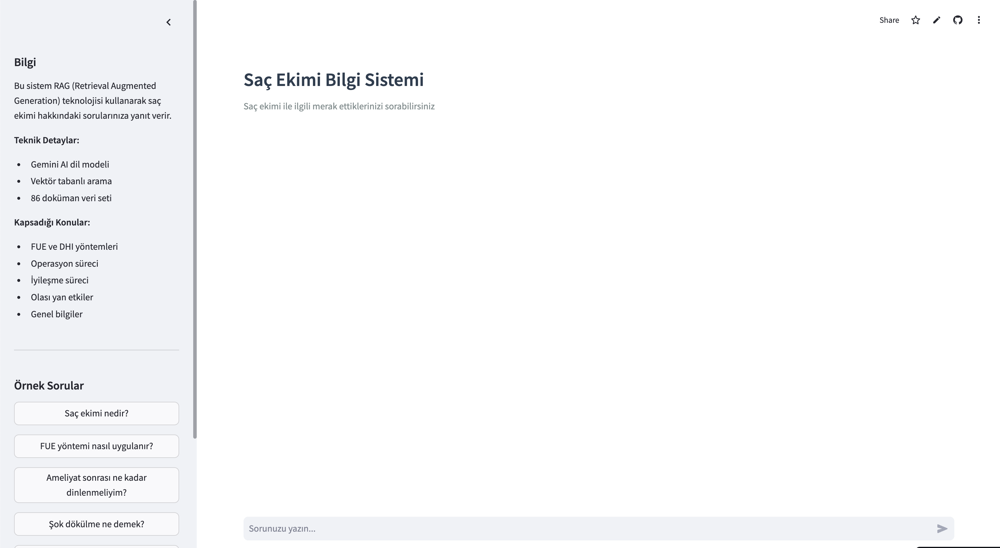
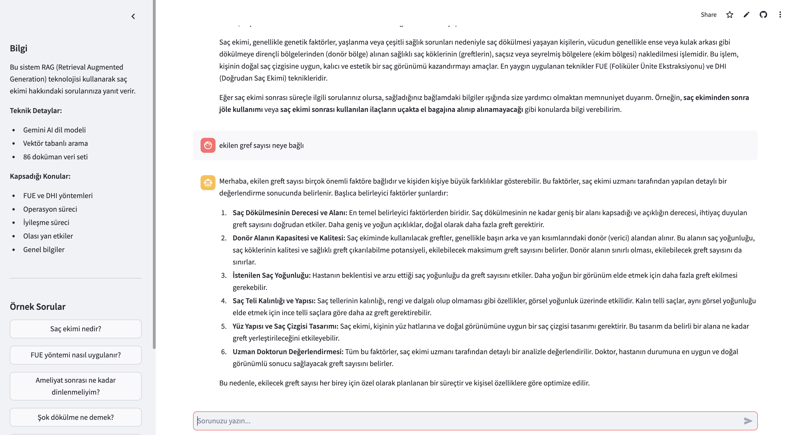
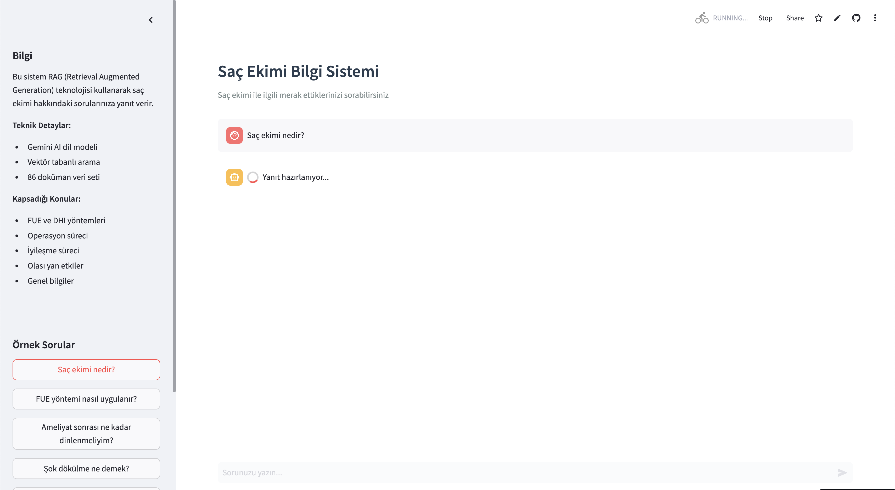

# Saç Ekimi Chatbot

Akbank Generative AI Bootcamp kapsamında geliştirilen RAG (Retrieval Augmented Generation) tabanlı bir soru-cevap sistemi.

## Genel Bakış

Bu proje, saç ekimi konusunda bilgi arayan kullanıcılara yardımcı olmak amacıyla geliştirilmiştir. Sistem, vektör tabanlı arama ve büyük dil modelleri kullanarak kullanıcı sorularına doğru ve bağlama uygun yanıtlar üretir.

## Ekran Görüntüleri

### Ana Arayüz


### Sohbet Örneği


### Yanıt Hazırlanıyor


## Proje Yapısı

```
chat_bot/
├── data/
│   └── sac_ekimi_veri_seti.py    # Veri seti (86 doküman)
├── src/
│   ├── __init__.py
│   ├── app.py                     # FastAPI backend
│   └── rag.py                     # RAG pipeline
├── app_streamlit.py               # Web arayüzü
├── requirements.txt
└── README.md
```

## Teknik Detaylar

### Veri Seti
Veri seti, saç ekimi web sitelerinin "Sık Sorulan Sorular" bölümlerinden derlenmiştir. Toplamda 86 adet soru-cevap çiftinden oluşmaktadır. İçerik şu kategorileri kapsar:
- Temel bilgiler ve tanımlar
- FUE ve DHI yöntemleri
- Operasyon süreci
- Post-operatif bakım
- Yan etkiler ve riskler
- Fiyatlandırma

### RAG Teknolojisi Nedir?
RAG (Retrieval Augmented Generation), büyük dil modellerinin bilgi üretme yeteneklerini dış bilgi kaynaklarıyla birleştiren bir tekniktir. Bu projede RAG kullanılmasının nedenleri:

- **Doğruluk:** Model, kendi eğitim verisi yerine güncel ve doğrulanmış bilgilerden yanıt üretir
- **Kaynak Kontrolü:** Yanıtlar, veri setindeki spesifik dokümanlara dayanır
- **Hallucination Önleme:** Model, bilmediği konularda uydurma yapmaz, sadece verilen bağlamdan yanıt verir

### LangChain Framework
LangChain, dil modelleri ile uygulama geliştirmek için kullanılan bir framework'tür. Bu projede tercih edilme sebepleri:

- **Modülerlik:** Embedding, vector store ve LLM bileşenlerini kolayca entegre eder
- **LCEL (LangChain Expression Language):** Chain'leri basit ve okunabilir şekilde tanımlamayı sağlar
- **Ekosistem:** Chroma, Gemini gibi araçlarla hazır entegrasyonlar sunar

### Teknoloji Stack
**RAG Pipeline:**
- LangChain framework ile LCEL (LangChain Expression Language) implementasyonu
- Google Generative AI Embeddings (text-embedding-004)
- Chroma vektör veritabanı
- Gemini 2.5-flash dil modeli

### Mimari

Sistem, üç temel aşamadan oluşur:

1. **Retrieval (Bilgi Getirme):** Kullanıcı sorusu vektör uzayında aranır ve en ilgili dokümanlar bulunur
2. **Augmentation (Zenginleştirme):** Bulunan dokümanlar bağlam olarak dil modeline iletilir
3. **Generation (Üretim):** Dil modeli, bağlamı kullanarak kullanıcı sorusuna uygun yanıt üretir

#### Sistem Mimarisi

```
┌──────────────────────────────────────────────────────────────┐
│                        Kullanıcı                             │
│                     (Web Tarayıcı)                           │
└────────────────────────────┬─────────────────────────────────┘
                             │
                             ▼
┌──────────────────────────────────────────────────────────────┐
│                   Streamlit Arayüzü                          │
│              (Web UI - app_streamlit.py)                     │
└────────────────────────────┬─────────────────────────────────┘
                             │
                             ▼
┌──────────────────────────────────────────────────────────────┐
│                    RAG Pipeline (src/rag.py)                 │
│                                                              │
│  ┌────────────────────────────────────────────────────┐    │
│  │  1. EMBEDDING                                      │    │
│  │     Kullanıcı sorusu → Vektöre dönüştürme         │    │
│  │     (Google Generative AI Embeddings)             │    │
│  └───────────────────────┬────────────────────────────┘    │
│                          │                                   │
│                          ▼                                   │
│  ┌────────────────────────────────────────────────────┐    │
│  │  2. RETRIEVAL                                      │    │
│  │     Vektör veritabanında benzer dokümanları ara    │    │
│  │     (Chroma DB - 86 doküman)                       │    │
│  └───────────────────────┬────────────────────────────┘    │
│                          │                                   │
│                          ▼                                   │
│  ┌────────────────────────────────────────────────────┐    │
│  │  3. AUGMENTATION                                   │    │
│  │     Bulunan dokümanları bağlam olarak ekle         │    │
│  │     (Context + Soru)                               │    │
│  └───────────────────────┬────────────────────────────┘    │
│                          │                                   │
│                          ▼                                   │
│  ┌────────────────────────────────────────────────────┐    │
│  │  4. GENERATION                                     │    │
│  │     Bağlam kullanarak yanıt üret                   │    │
│  │     (Gemini 2.5-flash)                             │    │
│  └───────────────────────┬────────────────────────────┘    │
│                          │                                   │
└──────────────────────────┼───────────────────────────────────┘
                           │
                           ▼
                   ┌───────────────┐
                   │  Türkçe Yanıt │
                   └───────────────┘
```

#### LCEL Chain Yapısı

```python
# LCEL chain yapısı
rag_chain = (
    {"context": retriever | format_docs, "question": RunnablePassthrough()}
    | prompt
    | llm
    | StrOutputParser()
)
```

## Kurulum

### Gereksinimler
- Python 3.9 veya üzeri
- Gemini API anahtarı ([buradan edinilebilir](https://ai.google.dev/))

### Adımlar

1. Depoyu klonlayın:
```bash
git clone https://github.com/plnalaca/Chatbot-Akbank-GenAI-Bootcamp.git
cd Chatbot-Akbank-GenAI-Bootcamp
```

2. Sanal ortam oluşturun ve aktifleştirin:
```bash
python3 -m venv .venv
source .venv/bin/activate  # macOS/Linux
# Windows için: .venv\Scripts\activate
```

3. Gerekli paketleri yükleyin:
```bash
pip install -r requirements.txt
```

4. Ortam değişkenlerini ayarlayın:
```bash
cp .env.example .env
# .env dosyasını düzenleyerek API anahtarınızı ekleyin
```

5. Uygulamayı başlatın:
```bash
streamlit run app_streamlit.py
```

Uygulama `http://localhost:8501` adresinde çalışmaya başlayacaktır.

> **Not:** İlk sorgu sırasında vektör veritabanı oluşturulacağı için işlem 30-40 saniye sürebilir. Sonraki sorgular 2-3 saniye içinde yanıtlanır.

## Özellikler

- Gerçek zamanlı soru-cevap sistemi
- Oturum tabanlı sohbet geçmişi
- Hazır örnek sorular
- Responsive tasarım
- Türkçe dil desteği

## Demo

**Canlı Demo:** https://sac-ekimi-soru-cevap-chatbot.streamlit.app/

**Yerel:** http://localhost:8501
